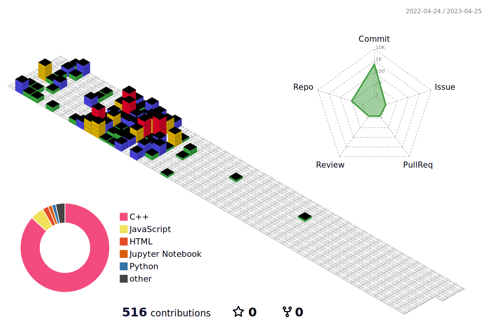

 

### :man_technologist: I'm Preetinder Singh  and I'm interested in Ethical Hacking and web development
Currently I'm learning Ethical Hacking (Web application pentesting) and practicing to improve data structures & algorithms,

 
<h2>Social Network</h2>

[![Twitter][1.2]][1] [![LinkedIn][2.2]][2] [![Instagram][3.2]][3] [![Telegram][4.2]][4]

[1.2]: https://s4.uupload.ir/files/twitter_prkb.png
[2.2]: https://s4.uupload.ir/files/linkedin_amwn.png
[3.2]: https://s4.uupload.ir/files/instagram_6djz.png
[4.2]: https://s4.uupload.ir/files/telegram_q47u.png

[1]: https://twitter.com/preetinder0031
[2]: https://www.linkedin.com/in/preetinder-singh-bajaj/
[3]: https://www.instagram.com/preetinder.0031
[4]: http://telegram.me/preetinder01

 
<h2>Skills</h2>

  

  

  
<b>:gear: &nbsp;Git statistics</b>

  
  
 
 
 
 

